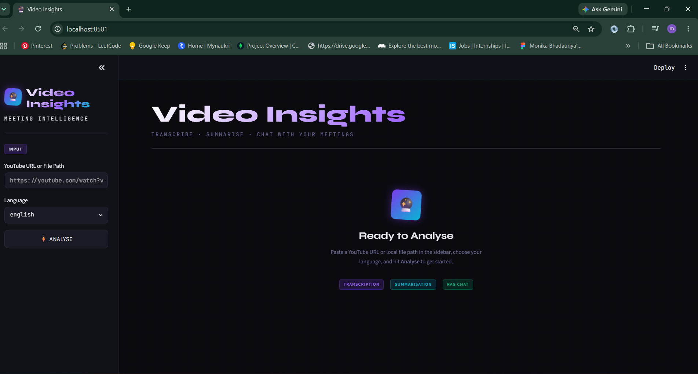
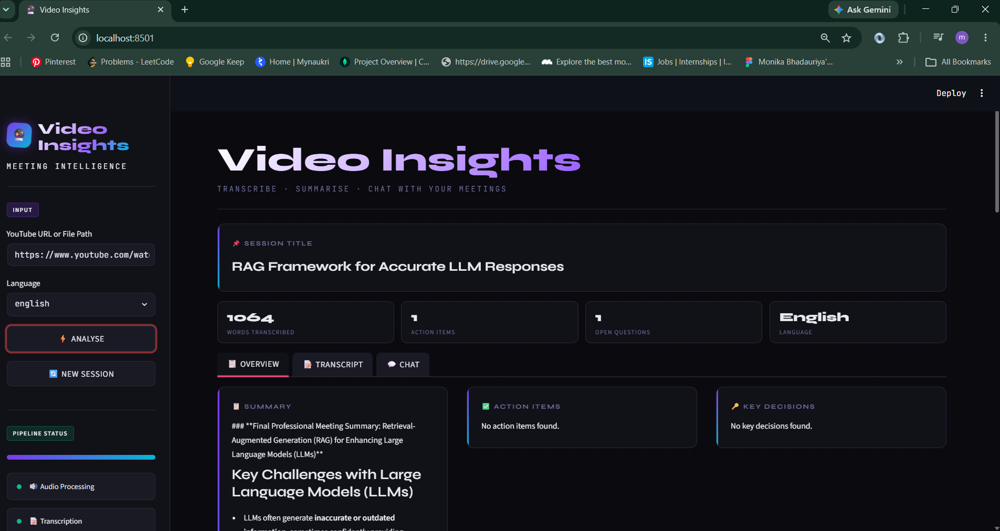
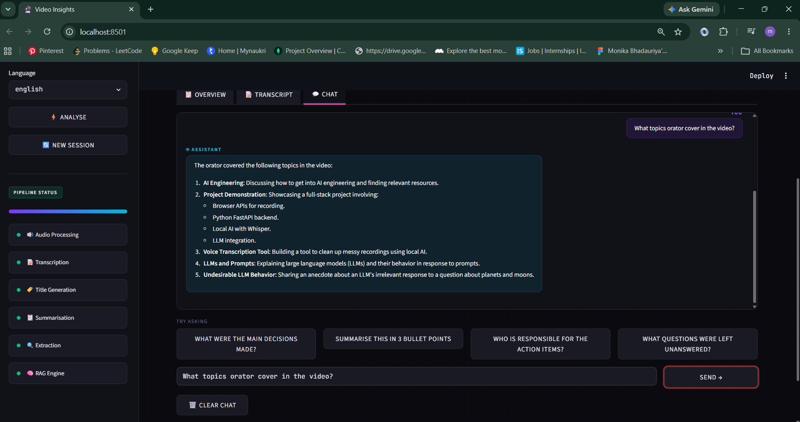
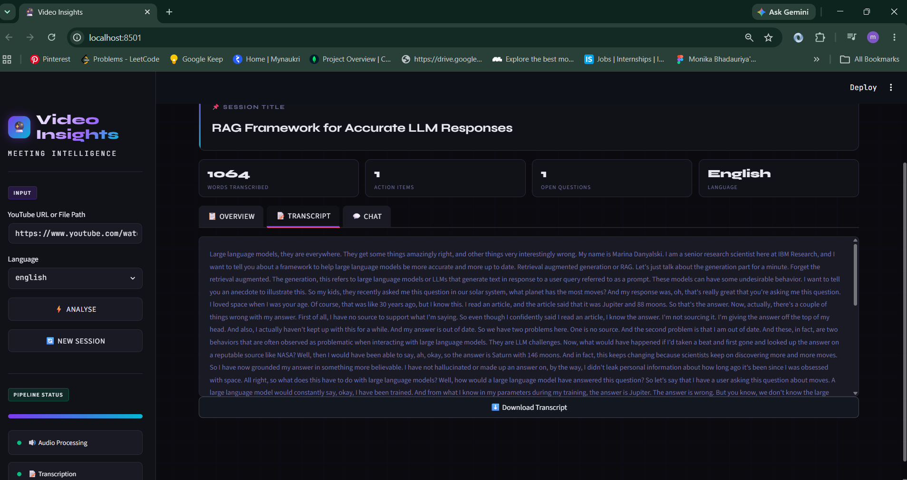

# 🎥 Video Insights AI

An AI-powered application that converts YouTube videos into structured insights.

The application downloads audio from a YouTube video, transcribes the speech, generates a summary, extracts action items, key decisions, and open questions, and allows users to ask questions about the video using Retrieval-Augmented Generation (RAG).

---

## Features

- 🎬 Process YouTube videos and local videos
- 📝 Speech-to-text transcription
- 📄 AI-generated summary
- ✅ Extract action items
- 🔑 Identify key decisions
- ❓ Extract open questions
- 💬 Chat with the transcript using RAG
- 🌐 Supports English and Hinglish

---
## Tech Stack

- **Programming Language:** Python
- **Frontend:** Streamlit
- **Audio Processing:** FFmpeg, yt-dlp
- **Speech Transcription:** OpenAI Whisper, Sarvam AI
- **Large Language Model (LLM):** Mistral AI
- **Embeddings:** HuggingFace Embeddings
- **Vector Database:** ChromaDB
- **RAG Framework:** LangChain (LCEL)

---

## Project Workflow

YouTube URL
      │
      ▼
Extract Audio
      │
      ▼
Split into Chunks
      │
      ▼
Transcription
      │
      ▼
Generate Transcript
      │
      ▼
Summary + Title
      │
      ▼
Extract:
 • Action Items
 • Decisions
 • Questions
      │
      ▼
Create Embeddings
      │
      ▼
Store in ChromaDB
      │
      ▼
RAG Chat
      │
      ▼
Answer User Questions
---

## Project Screenshots

### Home Page



---

### Analysis Dashboard



---

### Chat with Transcript



---

### Transcript



---

## Installation

Clone the repository

```bash
git clone https://github.com/yourusername/video-insights.git
```

Move into the project

```bash
cd video-insights
```

Install dependencies

```bash
pip install -r requirements.txt
```

Run the application

```bash
streamlit run app.py
```

---

## Environment Variables

Create a `.env` file in the project root and add the following API keys:

```env
MISTRAL_API_KEY=your_mistral_api_key
SARVAM_API_KEY=your_sarvam_api_key
```
---

## Future Improvements

- Support multiple languages
- PDF report export
- Speaker diarization
- Cloud deployment

---

## Author

**Monika Bhadauriya**

Project Link:https://github.com/Monikabhadauriya/Video_Insights 
